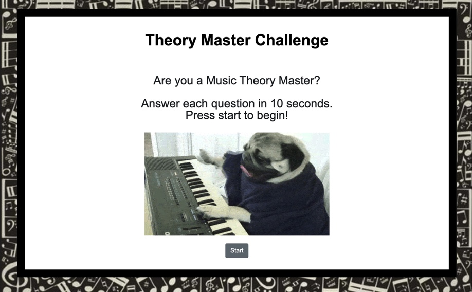
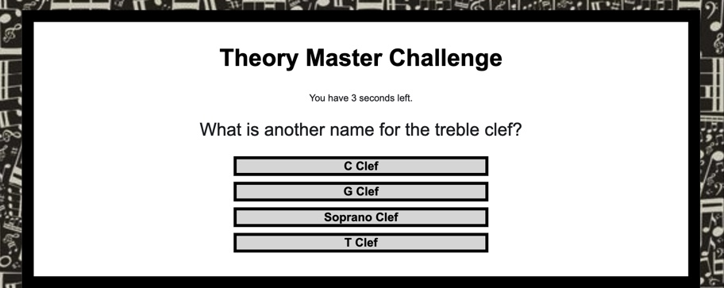
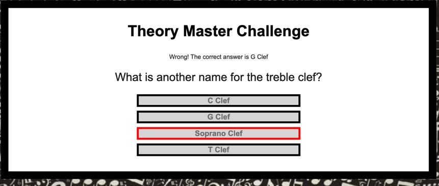
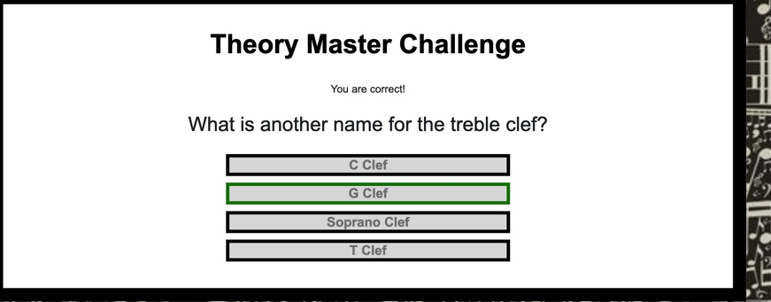
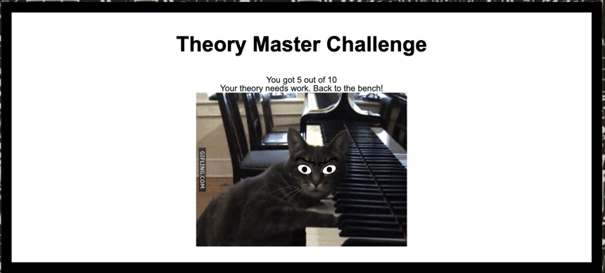

# TriviaGame

Demo a live version of this application here: [https://mkchung8.github.io/TriviaGame/]

Theory Master is a web application that puts your music theory knowledge to the test. 

The purpose of this application was to design a game using JavaScript for logic and jQuery for DOM manipulation.

## Getting Started

To use this game application, click on the link to the live demo listed above or clone the repository onto your machine. You can then navigate to the root directory to launch the application on your machine. 

To start playing, simply press the Start Button on the bottom of the page. 

The screen will display only one question at a time, prompting the user to answer within a time limit. 

Select your answer. If your answer was incorrect, the application will display the correct answer and move on to the next question. 

If your answer is correct, the application will keep track of your right answers and move onto the next question. 

After the user has completed all questions, the application will display how many questions were answered correctly. 

## Technologies Used 
* HTML/CSS
* JavaScript
* Bootstrap 
* jQuery

#### Code Created and Maintained by: 
Miyoung K. Chung 
mkchung.8@gmail.com
https://www.github.com/mkchung8/
https://www.linkedin.com/in/mkchung8/
